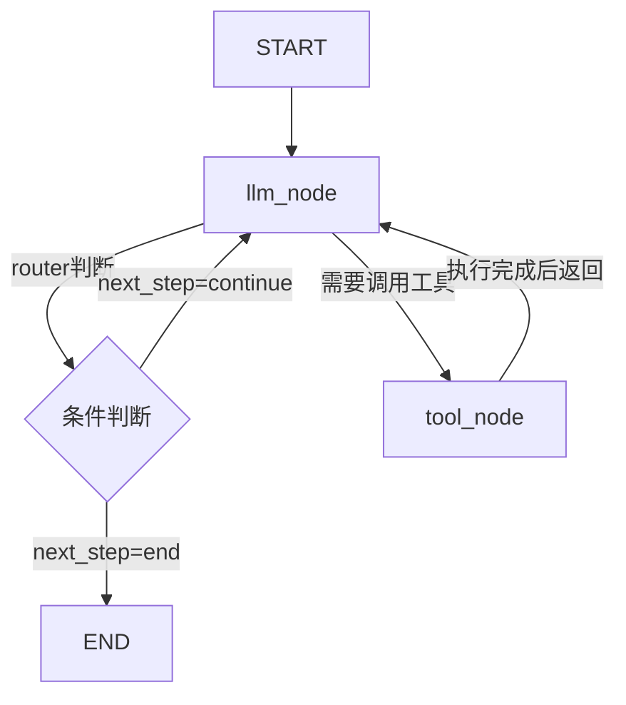
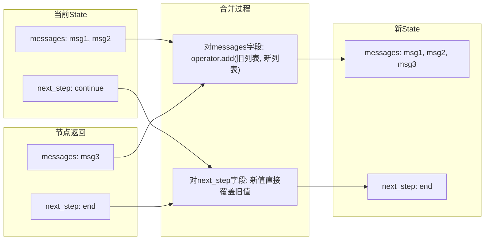
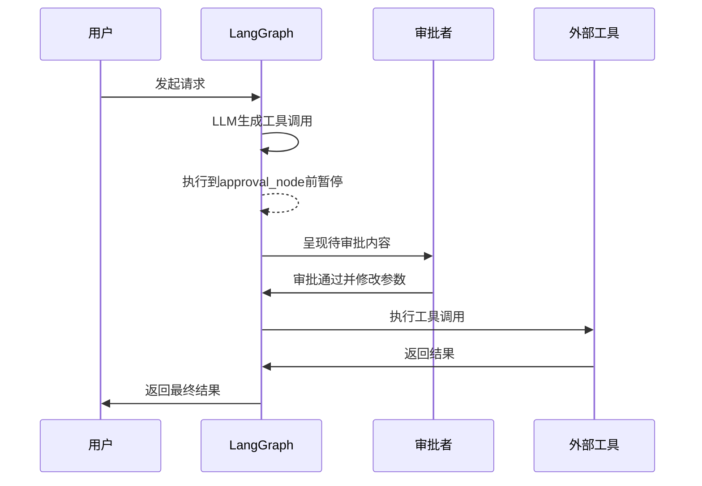

## 一、引言：从 DAG 到状态机

在很多工程师接触 LangGraph 之前，LLM 应用的开发体验其实已经有了一套看起来相当成熟的范式。以 LangChain 为代表的框架通过链式调用的方式，将多个 LLM 调用、工具使用、数据处理步骤串联起来，形成了一个看起来像流水线的执行过程。LCEL（LangChain Expression Language）更是把这种思路推到了极致，它允许开发者用声明式的方式定义一条数据流动的路径：输入从一端进入，经过若干个处理节点，最终从另一端输出。这个模型非常直观，对于很多场景也确实够用。

但问题恰恰出在够用这两个字上。一旦你开始尝试构建真正意义上的 Agent——那种需要根据环境反馈调整策略、在执行过程中反复思考、甚至在某些步骤上需要停下来等待人类介入的系统——你会发现 DAG 模型开始暴露出它的根本性局限。

DAG 的核心假设是数据单向流动，图结构中不存在环。这意味着整个执行过程必须在有限步数内完成，而且每一轮的输入输出关系是相对固定的。你可以用条件分支来改变执行路径，但分支本身仍然是前向的，你很难在一个链式结构中表达“如果结果不理想，回到前面的某个节点重新处理”这种逻辑。即便强行用循环包装一层，那个循环也是外部的，而不是执行引擎本身原生支持的。

真正的 Agent 行为本质上是有状态的、循环的。一个典型的 ReAct 模式 Agent 会在思考、行动、观察之间反复循环，直到它认为任务已经完成。每一次循环都会基于之前所有累积的信息来做出新的决策，这个过程中状态的维护和传递变得至关重要。传统的链式调用把状态隐藏在数据流动的管道里，开发者很难显式地控制它、检查它、修改它。当系统变得复杂，这种隐式状态管理就会成为调试和维护的噩梦。

这也就引出了 LangGraph 试图解决的核心问题：我们如何在一个形式化的框架中，既保留图结构带来的清晰性和可组合性，又原生地支持循环和复杂的状态管理？

LangGraph 的答案是借鉴图计算领域的成果，尤其是 Google 在 2010 年提出的 Pregel 模型。Pregel 是一个用于大规模图处理的编程模型，它的核心思想是以节点为中心进行计算，节点之间通过消息传递来通信，整个计算过程以超步（superstep）的方式同步推进。这个模型天然支持图中的环，而且有一套清晰的状态同步机制。LangGraph 把类似的思路引入到 LLM 应用的编排中，将 Agent 的运行过程抽象为一个可能带环的有向图，节点代表具体的计算逻辑（比如调用 LLM、执行工具函数、做条件判断），边代表控制流，而图的每一次完整遍历就是一个超步。

这样设计带来的好处是多方面的。首先，循环变成了图结构中的一个自然组成部分，不再需要外部包装。其次，状态变成了图执行过程中的一等公民——它贯穿整个图，在每个节点之间显式传递，而且可以用明确的方式定义状态的更新规则。第三，因为图结构的执行是受控的，框架可以在任意节点之间插入检查点、记录状态快照、甚至暂停执行等待外部输入，这让实现人机协同和时间旅行回溯变得异常简单。

理解这条从链式调用到图状态机的演进路径，是理解 LangGraph 设计哲学的关键。接下来的篇幅中，我们会从基础组件入手，逐步深入到状态管理、持久化、流式输出等核心机制，最后再回到架构选型的问题上，讨论在什么样的场景下 LangGraph 真正值得一试。

## 二、核心抽象：三大基本组件与使用方式

LangGraph 的 API 设计相当克制。整个框架围绕三个核心概念展开：状态、节点和边。只要把这三个概念之间的关系理清楚，构建一个基本的图应用就不需要太多心智负担。但正因为 API 表面简单，很多人在实际使用中会下意识套用传统的函数调用思维来理解它，这反而容易在状态更新、数据传递等关键环节上踩坑。所以我们有必要从设计逻辑的层面来讲解这些组件，而不只是罗列 API 用法。

### （一）状态：全局数据总线

如果你把 LangGraph 的图想象成一个电路板，状态就是从板子一头贯穿到另一头的主总线。每一个节点在计算时从这条总线上读取自己需要的数据，计算完成后把结果写回到总线上，供后续的节点使用。

在代码层面，状态通常用一个 Python 字典或 TypedDict 来定义。选择 TypedDict 是比较推荐的做法，因为它能给每个字段提供类型提示，IDE 会有更好的补全体验，同时也不会引入 Pydantic 那样的额外依赖。当然，如果你对数据校验有更高要求，用 Pydantic 模型来定义状态也是完全可行的，两者在 LangGraph 中都得到了很好的支持。

下面是一个最简单的状态定义示例：

```python
from typing import TypedDict

class AgentState(TypedDict):
    messages: list
    next_step: str
    context: dict
```

这个状态对象会在图的整个生命周期中存在，从 START 节点开始，每经过一个节点就经历一次更新，直到抵达 END 节点。这里有一个需要特别注意的概念，也是许多初次使用者会困惑的地方：节点函数返回的数据并不是一个全新的 State 对象，而是对当前 State 的一个更新描述。框架拿到这个更新描述之后，会根据预先定义的 Reducer 规则将它与当前 State 合并，生成新的 State。这意味着你可以在节点函数中只返回你想更新的字段，而不用把整个 State 重新构造一遍。这个机制的细节我们在第三节会专门展开。

状态图的初始化非常简单，一行代码就能完成：

```python
from langgraph.graph import StateGraph

graph = StateGraph(AgentState)
```

把状态类型传给 StateGraph 的构造函数之后，框架就知道在这张图中传递的数据结构是什么了。后续添加节点时，所有节点函数的输入输出类型都会被约束到这个状态类型上。

### （二）节点：图的执行单元

节点是图的原子执行单元。在实际业务中，一个节点可以封装任何你想做的事情：调用 LLM、执行本地函数、查询数据库、调用外部 API、甚至调用另一个子图。LangGraph 对节点的实现几乎没有限制，只要它是一个接受当前 State 并返回状态更新的 Python 函数或 Runnable 对象即可。

函数签名大致是这样的：

```python
def my_node(state: AgentState) -> dict:
    # 从 state 中读取需要的数据
    messages = state["messages"]
    # 执行计算逻辑
    result = do_something(messages)
    # 返回需要更新的字段
    return {"messages": result, "next_step": "continue"}
```

返回值是一个字典，字典中的键对应状态中的字段。你不需要返回状态中的所有字段，只返回你想更新的那几个就行。框架会自动处理合并。

添加节点到图中用的是 `add_node` 方法：

```python
graph.add_node("llm_node", llm_call_function)
graph.add_node("tool_node", tool_execution_function)
```

这里有三个特殊的节点名需要提一下。`START` 和 `END` 是框架内置的特殊节点，分别代表图的入口和出口。START 节点不需要你自己定义，它是一个虚拟的起始标记，用于连接第一条边。END 节点则是一个终结标记，一旦控制流到达 END，图的执行就结束了。

另外一个实际开发中非常常见的模式是用 Runnable（特别是 LangChain 的 chain）作为节点。因为 LangGraph 和 LangChain 是同一团队的产品，两者有很好的互操作性。你可以直接把一个 LCEL chain 包装成节点，LangGraph 会自动处理输入输出适配。

### （三）边：图的控制流骨架

节点定义了做什么，边定义了什么时候做。LangGraph 提供了两种边来构建控制流：普通边和条件边。

普通边的语义是无条件顺序执行。`graph.add_edge("A", "B")` 意味着节点 A 执行完毕后，一定会执行节点 B。这种边在构建线性流程时非常简洁。

```python
graph.add_edge(START, "llm_node")
graph.add_edge("tool_node", END)
```

但仅有普通边是不够的。Agent 之所以能表现出智能，核心在于它能够根据当前状态做出不同的决策。这里就引入了条件边。

条件边通过 `add_conditional_edges` 方法添加，它需要三个参数：源节点、一个路由函数（router）、以及一个路由映射表。路由函数接收当前 State 作为输入，返回一个字符串，框架根据这个字符串和映射表决定下一个要执行的节点是什么。

```python
def router(state: AgentState) -> str:
    if state["next_step"] == "continue":
        return "llm"
    else:
        return "end"

graph.add_conditional_edges(
    "llm_node",
    router,
    {"llm": "llm_node", "end": END}
)
```

这段代码的含义是：当 llm_node 执行完毕后，调用 router 函数来判断状态，如果返回 "llm"，控制流就回到 llm_node（形成循环）；如果返回 "end"，控制流就走向 END，结束执行。这正是 Agent 循环逻辑的精髓所在——LLM 在每一步都可以决定是否需要继续调用工具、重新思考、或者终止任务。

整张图的骨架通常可以这样组织：

```python
graph.add_edge(START, "llm_node")
graph.add_conditional_edges("llm_node", router, {...})
graph.add_edge("tool_node", "llm_node")
```

下面是这种循环结构的 Mermaid 图表示：



这个简单的循环结构其实已经具备了 Agent 的所有基本要素：有一个负责思考决策的 LLM 节点，有一个执行具体操作的工具节点，还有一个根据状态动态决定走向的路由逻辑。在实际工程中，LLM 节点会生成工具调用的请求，路由函数检测到请求后把控制流转到工具节点，工具节点执行完毕后把结果写回状态，然后再回到 LLM 节点继续思考。这个循环会持续直到 LLM 认为任务完成，路由函数返回终止信号。

对比传统的链式调用，你会发现这种结构的表达能力要强得多。在链式调用中，如果你想实现同样的循环逻辑，要么需要写一个外层的 while 循环手动管理状态，要么需要依赖框架提供的有限循环原语（比如 LangChain 的 AgentExecutor，它内部封装了循环逻辑，但自定义和调试起来非常困难）。LangGraph 把循环变成了图结构的一部分，让整个执行过程变得透明可控。

## 三、深度剖析：状态管理机制

状态管理是 LangGraph 整个框架中最容易让新手困惑的部分，同时也是它区别于其他编排框架的核心竞争力所在。如果你只是简单地用 LangGraph 搭一个线性流程，可能感觉不到状态管理有什么特别之处。但一旦涉及到多轮对话、工具调用结果累积、并行分支的数据合并等稍复杂的场景，理解状态管理的底层机制就变得至关重要了。

### （一）状态更新不是全量替换

这是很多人第一次接触 LangGraph 时最容易产生的误解。在传统的编程思维中，一个函数处理完数据后返回一个新对象，调用方用这个新对象替换原来的旧对象，这是非常自然的模式。但在 LangGraph 的图执行中，节点函数返回的数据并不是一个全新的 State 对象，它只是一个部分更新描述。

这个设计决策背后有实际的工程考量。在一个包含十几个字段的状态对象中，大多数节点只需要修改其中一个或几个字段。如果要求每个节点都返回完整的状态对象，代码会变得非常冗余，而且容易引入意料之外的字段覆盖错误。允许节点只返回需要更新的字段，让状态管理的责任从节点实现者转移到了框架层面，节点开发者只需要关心自己的输出，不用担心破坏其他节点的数据。

框架在收到节点返回的字典后，会逐个字段地与当前 State 合并。对于每一个字段，合并的具体行为取决于该字段在状态定义时是否关联了 Reducer 函数。如果字段没有显式指定 Reducer，框架使用默认策略：直接覆盖。

### （二）Reducer 机制：合并规则的定义

Reducer 本质上是一个函数，它接收两个参数：当前 State 中某个字段的现有值，以及节点返回字典中对应字段的新值，然后返回合并后的结果。通过 Annotated 类型注解，你可以为状态中的每个字段指定不同的 Reducer。

理解 Reducer 是理解 LangGraph 状态管理的钥匙。我们来看最典型的一个场景：消息列表的管理。

在对话式 Agent 中，消息列表会随着每一步的执行不断增长。每一轮 LLM 调用会产生新的消息，工具调用的结果也需要追加到消息列表中。如果你用默认的覆盖策略来处理消息列表，那每次节点返回新消息时都会把旧消息清掉，这显然不是我们想要的行为。

这里就需要引入 `operator.add` 作为 Reducer，它的行为是在旧列表的基础上追加新元素，而不是用新列表替换旧列表。

```python
from typing import TypedDict, Annotated
import operator

class AgentState(TypedDict):
    messages: Annotated[list, operator.add]
    summary: str
    context: dict
```

在这个定义中，`messages` 字段被标注为使用 `operator.add` 作为 Reducer。当某个节点返回 `{"messages": [new_message]}` 时，框架会用 `operator.add` 把 `new_message` 追加到现有消息列表的末尾，而不是整个替换。

LangGraph 还内置了一个专门为消息处理优化的 Reducer，叫 `add_messages`。它的功能比 `operator.add` 更丰富：它不仅能追加消息，还能根据消息的 ID 来识别重复消息，对已存在的消息进行更新而不是重复追加。这个功能在涉及消息去重和更新的场景中非常有用。

```python
from langgraph.graph import add_messages

class AgentState(TypedDict):
    messages: Annotated[list, add_messages]
```

这两种 Reducer 的选择取决于具体场景。如果你的消息列表只是单纯地递增，不会出现需要对已有消息进行更新的情况，`operator.add` 就足够用了。如果你的 Agent 场景中可能会对同一条消息进行多次修改（比如在 Human-in-the-Loop 场景中，人类可能会修改某条消息的内容），那么 `add_messages` 就更合适。

对于普通字段，你可以不显式指定 Reducer，框架会走默认覆盖逻辑。这在大多数场景下是合理的：当前步骤的决策结果本来就应该覆盖上一步的决策结果，而不是累积。

下面这张图可以帮助直观理解 Reducer 的工作流程：



这张图展示了一个非常典型的合并场景：消息列表字段因为有 `operator.add` Reducer，新消息被追加到了列表尾部；而 next_step 字段没有指定 Reducer，新值直接覆盖了旧值。

理解这个机制之后，你可以在实际开发中灵活地为不同字段设计不同的合并策略。比如对于计数器类型的字段，你可以定义一个累加的 Reducer；对于集合类型的字段，你可以定义一个并集操作的 Reducer。这种灵活性是 LangGraph 状态系统的一大优势。

### （三）Pregel 模型的影响

LangGraph 的状态管理机制并非凭空创造，它有一个明确的学术来源：Google 的 Pregel 图计算模型。对于大部分日常使用 LangGraph 的开发者来说，不需要深入了解 Pregel 的细节就能写出可用的代码。但理解这个背景有助于你把握框架设计的一些深层逻辑，尤其是在调试并行执行和检查点恢复等高级场景时。

Pregel 模型的核心思想是 BSP（Bulk Synchronous Parallel）计算。整个图计算被分成若干超步（Superstep），在每个超步中，所有活跃的节点并行地接收上一步传来的消息，执行计算，然后向下游节点发送消息。所有节点完成当前超步的计算后，系统进行一次全局同步，然后进入下一个超步。这个同步点就是 LangGraph 中状态的保存时机——每一步结束后的状态快照。

消息传递是这个模型中的关键概念。在 Pregel 中，节点之间不直接共享内存，而是通过显式的消息进行通信。LangGraph 把这个概念映射到了状态更新上：节点返回的更新字典本质上就是一种消息，框架负责把这些消息与当前状态合并，然后传递给下游节点。这种设计使得图执行的过程天然是可检查、可中断、可重放的。

另一个从 Pregel 继承来的特性是对图中环的处理。传统图分析中环往往会带来收敛性问题，但 Pregel 通过超步和消息驱动的设计让环变得可控。同样，LangGraph 通过条件边来实现环，而这些环的每一次迭代都经过状态更新、检查点保存，框架可以设置最大步数来防止无限循环。

对于绝大多数实际场景，你不需要手动管理任何与 Pregel 相关的底层细节。但这些概念会帮助你理解为什么在某些边界情况下，状态更新的时机和你预期的有所不同，以及为什么 LangGraph 的检查点机制能够做到步级别的精确恢复。

## 四、高阶控制流：持久化、中断与时间旅行

如果说状态管理是 LangGraph 的骨架，那么持久化与中断机制就是让它能够应对真实生产环境的肌肉系统。很多原型阶段看起来很美的 Agent 系统，一到生产环境就暴露出各种问题：会话状态丢失、无法中断等待人工审批、出错了没法回到之前的某个步骤重新执行。LangGraph 通过 Checkpointer 和 Interrupt 机制为这些问题提供了一套系统性的解决方案。

### （一）检查点机制：状态的持久化

LangGraph 的检查点机制本质上是在图的每一个超步结束时自动保存一次状态的完整快照。这个快照包含了当前 State 的所有字段值，以及足够的元数据来让框架在之后能够精确地恢复到这一刻的执行状态。

实现这一机制的核心组件是 Checkpointer。LangGraph 内置了多种 Checkpointer 实现来覆盖不同的使用场景。最简单的 MemorySaver 将快照保存在内存中，适合原型开发和单元测试。SqliteSaver 将状态持久化到 SQLite 数据库中，适合小规模的单机部署。对于生产环境，LangGraph 还提供了基于 Postgres 的 Checkpointer，能够支持高并发和高可靠性要求。

配置 Checkpointer 非常简单，只需要在编译图的时候传入即可：

```python
from langgraph.checkpoint.sqlite import SqliteSaver

checkpointer = SqliteSaver.from_conn_string("checkpoints.db")
app = graph.compile(checkpointer=checkpointer)
```

编译后的图在执行时会自动在每个节点结束后向 Checkpointer 写入状态快照。开发者不需要在每个节点中手动编写持久化逻辑，框架完全接管了这件事。

检查点机制的另一个关键概念是 Thread ID。每个图执行实例都关联一个唯一的线程标识符，框架通过这个标识符来隔离不同会话的状态。这意味着你可以用同一个编译后的图实例同时处理多个用户会话，每个会话各自维护独立的状态历史。对于构建多租户的 SaaS 应用来说，这是一个非常重要的能力。

Thread ID 的使用方式是在调用时通过配置传入：

```python
config = {"configurable": {"thread_id": "user-session-123"}}
app.invoke(initial_state, config)
```

同一个 thread_id 的多次调用会在之前保存的状态基础上继续执行，这使得 Agent 天然具备长期记忆能力。用户今天发起的对话，明天还能接着聊，因为状态被持久化了下来，下次调用时框架会自动加载最近的状态快照。

### （二）人机协同的底层逻辑

在很多企业应用中，Agent 不能完全自主地运行到底。某些关键操作——比如发送大额交易、发布正式公告、删除重要数据——需要在执行前暂停并等待人类的确认。LangGraph 通过中断机制优雅地支持了这种模式。

中断的配置是在编译图时通过 `interrupt_before` 和 `interrupt_after` 参数来实现的。这两个参数接收一个节点名称列表，指定在这些节点执行之前或之后暂停图的执行。

```python
app = graph.compile(
    checkpointer=checkpointer,
    interrupt_before=["approval_node"]
)
```

当图的执行到达 approval_node 时，框架会自动暂停，函数调用会返回当前的状态快照。此时开发者可以将状态信息呈现给人类审批者。审批者做出决定后，开发者可以通过修改状态并继续执行的方式来传递审批结果。

```python
# 第一次调用，会在 approval_node 前暂停
result = app.invoke(initial_state, config)

# 人类审批后，更新状态并继续
app.update_state(config, {"approved": True, "reason": "批准执行"})
final_result = app.invoke(None, config)
```

这里的 `update_state` 方法值得特别说明。它允许开发者直接修改 Checkpointer 中保存的状态数据，然后再继续执行。这意味着人类不仅可以批准或拒绝，还可以修改 Agent 之前的任何状态数据——改一个参数、修正一个错误、或者增加额外的上下文信息。这种能力在很多业务场景中非常重要，因为现实世界中的人类审批者往往不只是简单地说 yes 或 no，他们可能需要在审批过程中修正 Agent 理解偏差的地方。

下面的 Mermaid 图描述了一个典型的人机协同流程：



这种暂停-恢复的执行模式，叠加状态修改的能力，使得 LangGraph 在处理需要人机协同的复杂业务流程时具备了很强的灵活性。它不是简单地在工具调用前弹出一个确认框，而是允许在图的任意节点插入人工干预点，干预者可以查看和修改完整的上下文状态。

### （三）时间旅行与状态覆写

检查点机制记录了每一步的状态快照，这天然为时间旅行提供了可能。时间旅行在调试和异常处理场景中非常有价值：如果一个 Agent 执行了 20 步之后走进了死胡同，你不需要从头开始重跑整个流程，而是可以回到之前的某个状态快照，从那里开始重新执行。

LangGraph 通过 Checkpointer 保存的状态历史来实现这个功能。框架提供了接口来查看某个线程的所有历史快照，然后允许开发者指定恢复到某一个快照点。

```python
# 查看历史状态
history = list(app.get_state_history(config))

# 选择某个历史状态
old_state = history[5]

# 从该历史状态继续执行
app.invoke(None, config)
```

这个能力在调试时非常直观：你可以让 Agent 执行到第 10 步，然后回到第 5 步的状态，修改某个参数，再继续执行，观察不同的分支结果。这种探索式的调试方式比传统的一次次重跑整个流程的效率高得多。

从更大的视角来看，持久化、中断和时间旅行这三个能力叠加在一起，让 LangGraph 不只适用于简单的对话式 Agent，而是能够支撑更复杂的、需要长时间运行、涉及多个外部系统和人类参与的工作流场景。这是 LangGraph 相对于其他轻量级 Agent 框架的一个明显优势。

## 五、输入与输出：编译与流式响应

图定义好之后，需要经过编译才能运行。编译这一步在 LangGraph 中做了几件重要的事情：验证图结构的完整性（确保没有悬空的边、START 和 END 节点的连接是合法的）、冻结图的拓扑结构、初始化内部的执行引擎、以及绑定配置好的 Checkpointer 和中断设置。编译之后得到的 Runnable 对象就是我们可以直接调用的应用实例。

在调用方式上，LangGraph 提供了 `invoke` 和 `stream` 两种核心模式。`invoke` 是同步等待模式，它会完整地执行完整个图，然后返回最终的 State 对象。这种模式适合批处理任务或者不需要实时反馈的场景。

`stream` 模式则不同，它会在每个节点执行完毕后产出一个事件，包含该节点的名称和该节点执行后的状态更新。对于需要实时展示进度的场景——比如在聊天界面中显示 Agent 当前正在执行哪个步骤——`stream` 是更合适的选择。

```python
for event in app.stream(initial_state):
    for node_name, update in event.items():
        print(f"节点 {node_name} 执行完毕，更新内容：{update}")
```

这里的流式输出是节点级别的，也就是说你只能知道哪个节点执行完了，但看不到节点内部（特别是 LLM 调用过程中）的逐 token 输出。对于构建实时聊天应用来说，这个粒度还不够细。用户期待的是像 ChatGPT 那样一个字一个字地输出，而不是等整个节点跑完了再一次性显示一整段文本。

要实现 token 级别的流式输出，需要借助 LangGraph 的异步能力。在异步调用模式下，你可以将底层 LLM 的流式输出穿透到图的外部。具体做法是在节点函数中使用异步流式的 LLM 调用，然后通过自定义的事件机制将 token 逐条透出。

```python
async def llm_node_streaming(state):
    messages = state["messages"]
    async for chunk in llm.astream(messages):
        yield {"llm_output": chunk}
```

然后在外部消费这些事件时，可以实时获取到 token 级别的输出，实现和用户期待一致的打字效果。

这种设计体现了 LangGraph 在封装粒度上的取舍。框架本身关注的是图级别的编排和状态管理，对于节点内部的执行细节（包括 LLM 的流式输出、工具调用的进度反馈等）采取的是提供通道而非强制接管的态度。开发者可以根据自己的需求选择合适的粒度来消费这些信息。

## 六、架构选型：何时该用 LangGraph

在工程实践中选择技术方案，最难的部分往往不是理解某个工具的功能，而是判断这个工具是否适合手头的问题。LangGraph 的功能看起来很强大，但并不是所有 LLM 应用都值得引入这样一个有状态的图执行引擎。

对于线性任务——典型的 RAG 检索增强生成流程、文档摘要、数据提取等——使用 LangGraph 往往是过度设计。这类场景的数据流向是单向的，每一步做什么是确定的，不需要动态决策，不需要循环重试。用 LangChain 的 LCEL 或者直接用几行 Python 代码拼装调用逻辑就足够了。引入 LangGraph 只会增加代码复杂度和维护负担，没有实际收益。

真正值得用 LangGraph 的场景通常具备以下特征中的一条或多条。第一，任务需要 Agent 在多个步骤之间动态决策，每一步的选择依赖于之前所有步骤的结果，而且无法预先定义完整的执行路径。第二，任务需要循环迭代，直到某个条件满足为止，而且这个循环是内生的（是 Agent 自身策略的一部分），不是外部强加的。第三，系统需要在执行过程中暂停等待人类输入或外部系统回调，暂停点可能出现在任意位置。第四，调试和可观测性要求高，需要能够回溯历史状态、复现问题、修改中间状态后重试。第五，系统需要长时间运行，可能跨越多天甚至更久，状态的持久化和恢复能力是硬需求。

在这些场景下，LangGraph 能够提供的价值远超过它带来的复杂度开销。它的状态管理机制让你可以精确控制 Agent 的行为，检查点机制让长时间运行的任务有了容错能力，中断机制让人机协同变得自然。

LangGraph 本质上不是一个模型库，也不是一个工具集，它是一个专为 LLM 应用优化的图执行引擎。它解决的核心问题是：当你的 Agent 系统不再是一个简单的请求-响应流水线，而是一个有状态的、需要精确控制执行流程的复杂系统时，你用什么来编排它？LangGraph 给出的答案是用图的思维、状态机的思维来建模，把 Agent 的智能行为和工程的严谨性结合在一起。

在选择技术栈时，最终的标准应该落在复杂度是否匹配上。用简单的工具解决简单的问题，用强大的框架解决复杂的问题。理解每一个工具的适用边界，比盲目追捧或贬低某个工具要有意义得多。
