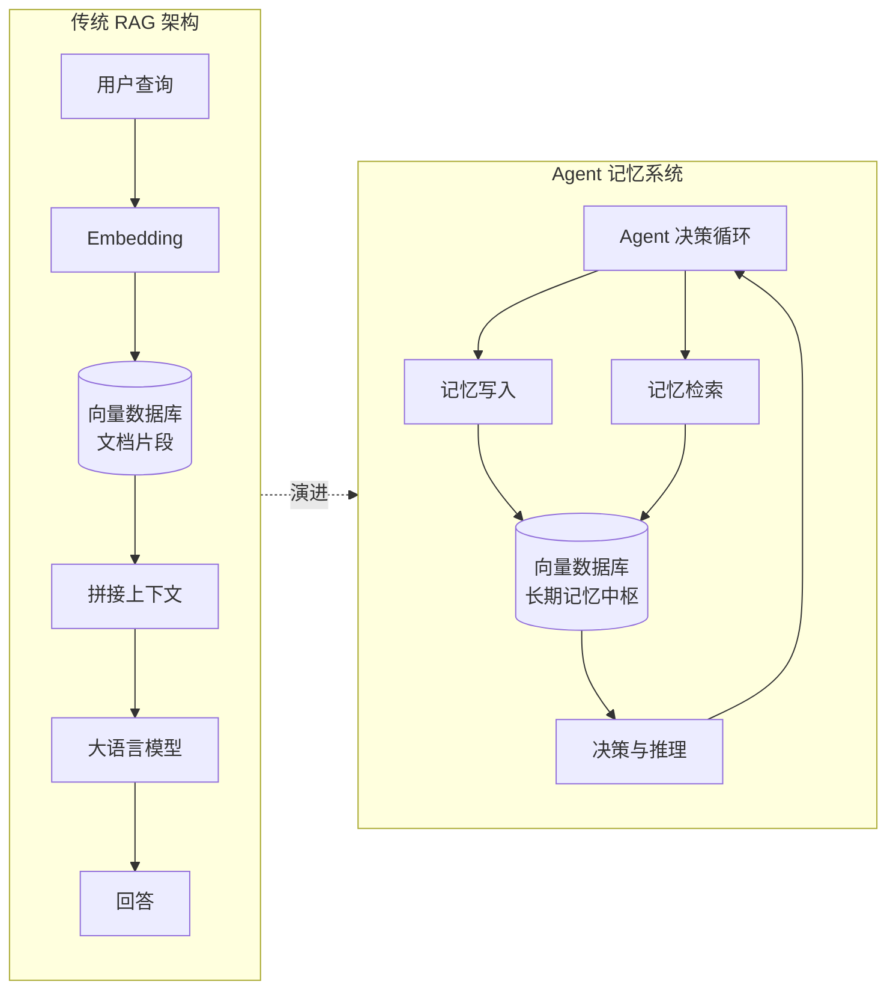
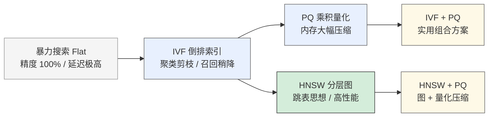
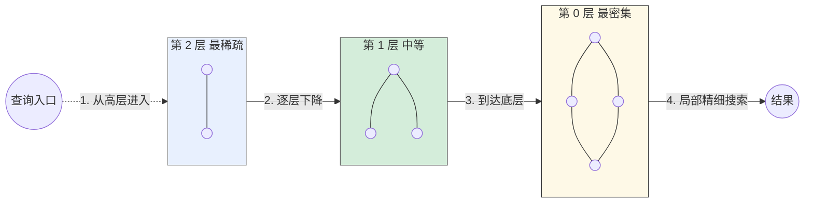
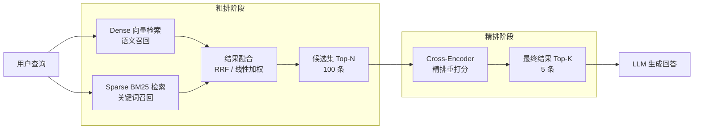
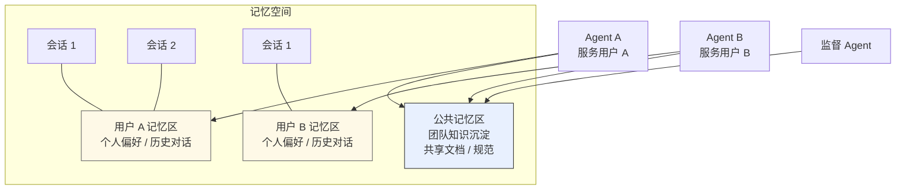
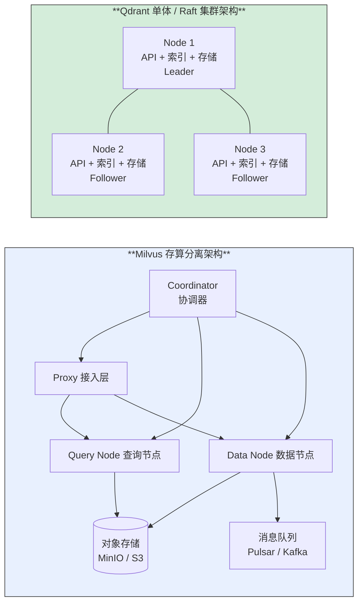
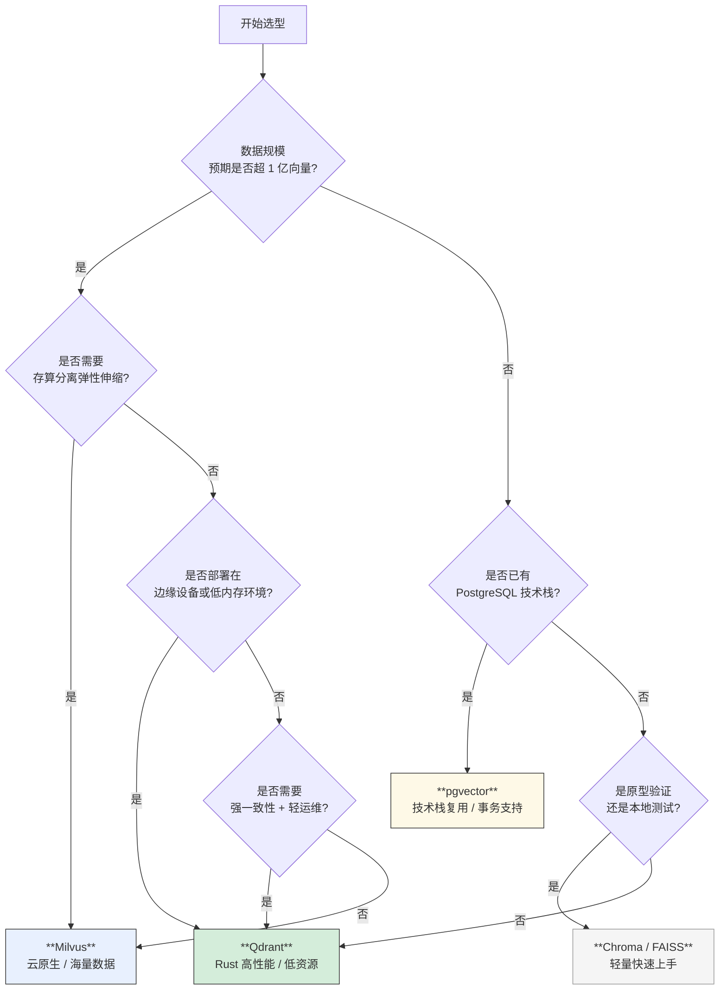

## 一、为什么 Agent 需要专属的记忆引擎？

如果你开发过基于大语言模型的 Agent，大概率会碰到一个让人头疼的场景：当 Agent 需要回忆几百个对话轮次之前用户提到的某个偏好，或者需要综合三个月前一份技术文档里的细节来回答问题时，单纯的模型上下文窗口显得捉襟见肘。人们常常把这个问题叫作大模型的失忆症。表面上看，这是上下文窗口大小的限制——即便今天已经有了一百万 Token 的窗口，把海量的历史文档全塞进去，检索效率和推理成本也会变得难以接受。更深层的问题在于，传统的关系型数据库或者 KV 缓存并不是为此类模糊、语义化的记忆检索而设计的。

关系型数据库依赖精确的结构化匹配。你想找到所有讨论过某个技术方案的人，可以通过 SQL 的 JOIN 和 WHERE 条件来精确圈定。但如果你想让系统回忆起那些与上周聊过的某个创意相似、但并不完全相同的想法，传统索引立刻失效。KV 缓存确实可以通过简单键值对存储会话历史，但它的检索维度是单一的，无法支持基于语义相似度的记忆提取。因此，对于 Agent 来说，它需要的不是一个简单的数据仓库，而是一个能将非结构化、高维度的语义信息变成可计算、可查询的记忆引擎。这正是向量数据库登场的舞台。

在整个 Agent 架构中，向量数据库的定位经历了一次明显的升维。最早它只是 RAG（检索增强生成）管道中的一个组件，负责根据用户问题从文档库里找回相关片段，塞进提示词。这个阶段它的角色接近于一个聪明的文档检索引擎。但当 Agent 从单次对话的工具变成需要跨会话、跨任务维护状态和知识的自治实体时，向量库就成了长期记忆的物理载体。它不再只是给模型补充上下文，而是 Agent 本身认知的一部分。Agent 的每一次思考、每一次决策反馈、从环境里学到的每一条新知，都以向量形式被沉淀在这个库里，形成一种可以生长和衰减的动态记忆。下图展示了向量数据库从简单 RAG 组件到 Agent 记忆中枢的定位变化：

---

## 二、向量与相似度的数学直觉

理解向量数据库的工作方式，需要先建立起对向量和相似度判定的直观认识。这里不打算罗列公式，而是聚焦在思维模型上：我们是如何把一句人话、一张图片或一段代码变成一个高维空间里的点，并且让机器理解点和点之间孰近孰远的。

Embedding 的过程本质上是一次降维的语义投射。语言或图像这类非结构化数据，在原始形态下极度稀疏且混杂，而 Embedding 模型通过大规模预训练，学会了将语义相近的实体，映射到高维空间中彼此靠近的位置。这个空间的维度通常在几百到几千维之间，每一个维度并不对应一个可解释的语言特征，而是一种分布式的、交织在一起的语义表征。业界常把这类向量叫作稠密向量，因为它几乎每一维都有非零值，携带了来自上下文和训练目标的丰富信息。与之相对的是稀疏向量，它们大部分维度为零，只在少数维度上有值，常见于基于词频的传统语义表示，例如 TF-IDF 或 BM25 生成的向量。二者的本质区别在于，稠密向量擅长捕捉语义和上下文关系，而稀疏向量则在关键词精确匹配上拥有天然优势。

既然万物都变成了点，那么怎么定义相似就是一个核心问题。工程上最常见的三种度量是欧氏距离、余弦相似度和内积。欧氏距离衡量的是空间中两点之间的绝对距离，最直观也最容易理解。它在图像检索或者音视频匹配领域很常用，因为当像素或声学特征的绝对数值差异不大时，往往意味着内容高度一致。但在自然语言处理里，它的局限性也很明显：同样的语义用长短不同的句子表达，在向量空间中的绝对值可能相差甚远，但方向却非常接近。这就是为什么文本检索几乎都默认选择余弦相似度，因为它只在意两个向量的夹角，而不关心它们各自的长度。语义是否相关，更多取决于方向的一致性，而不是绝对值大小。内积则兼具方向和长度的考量，在某些推荐系统模型里有独特优势，因为它可以同时捕捉兴趣点和置信度。

理解了向量和距离，也就更容易看透维度灾难为什么会让传统索引结构彻底崩盘。像 B+ 树这类依赖于排序和范围查询的索引，在一维或低维空间里效率极高，因为它们可以通过排序把临近的数据物理上也存储在一起。但在几百上千维的空间里，基于任何单一维度的排序都会导致数据在其他维度上完全离散。再加上高维空间里几乎任意两点之间的距离分布趋向集中，所谓的最近邻和大部分随机点差异并不大，全表扫描也就成了唯一的无奈之选。正因如此，向量数据库的核心竞争力就在于用近似算法在这个几乎同质的空间里，以可接受的精度损失换取数量级上的速度提升。

---

## 三、揭秘近似最近邻索引引擎

既然精确匹配成本过高，近似最近邻算法就成为了所有主流向量数据库的基石。这里的核心权衡只有一个，那就是召回率与延迟之间的博弈。你愿意牺牲 5% 的精度，却换来百倍甚至千倍的查询加速，这在绝大多数 Agent 记忆检索场景里，都是非常划算的选择。下面这张图概括了几种主流 ANN 算法的演进关系及其核心思路：

IVF（倒排文件索引）是最早被广泛采用的加速方法之一。它的思想并不复杂：在建索引阶段，先用 K-Means 这样的算法对整个向量空间做聚类，将所有数据切分成很多个桶，每个桶由一个聚类中心代表。查询时，先拿查询向量和所有聚类中心做一次粗略比较，找到最靠近的几个桶，然后只在这几个桶内部做精确检索。这种方式相当于在搜索开始前，先用 Voronoi 图对整个空间做了一次硬性切割，让搜索范围骤减。IVF 的问题是，如果聚类中心数量设置不当，或者真实查询向量的分布恰好落在多个桶的边界附近，就很容易遗漏那些原本相近的点，导致召回率不稳定。

PQ（乘积量化）解决的是另一个维度的问题：内存占用。在 Agent 记忆场景里，很可能需要存储上亿条历史交互或知识片段，如果每条都用完整的浮点数向量表示，内存会迅速成为瓶颈。PQ 的做法是将高维向量切分成若干短片段，然后在每个片段内部独立做聚类，用聚类中心的索引号代替原始浮点值。这样一条向量最终可以用一串短整数码本号来表示，内存压缩比可以达到一个数量级。当然，这种压缩是有损的，检索时先通过码本把查询向量展开，再与压缩后的向量近似比较距离。它在计算效率和内存开销之间找到了一个很精巧的平衡点。

HNSW，也就是分层可导航小世界图，是当前工业界综合表现最亮眼的算法之一。它的灵感来自跳表，只不过把一维链表的快速跨越思想，搬到了高维图网络上。HNSW 构建时会生成一个多层次的图结构，最上层节点稀疏，承担着高速公路的作用，负责在搜索早期快速跨越大片空间；越往下层节点越密，负责在局部区域做精细寻路。插入和查询都是从最高层随机进入，逐层下降，每一层都在当前图中采用贪心策略向目标靠近。这种结构让检索复杂度控制在 O(logN) 级别，同时在很多基准测试里维持了很高的召回率。下面这张图直观展示了 HNSW 的分层结构以及查询时的导航路径：

在 Agent 调优中，两个参数尤为关键。`m` 决定了每个节点在图中的最大连接数，连接的稠密程度直接影响了图的导航能力和构建时间。`m` 太大会导致构造极慢且内存膨胀，太小则让图变得稀疏，召回下降。`ef_construction` 是建图时候的搜索宽度，它越大，图质量越高，对召回越友好，但构建索引的时间也成倍增长。一个实战中的经验是，如果你的 Agent 记忆主要是离线构建且不频繁更新，可以适当拉高 `ef_construction` 来换取更精准的记忆网络；而在在线实时写入场景，则需要压低它，优先保证吞吐。

---

## 四、面向 Agent 场景的高级检索技巧

如果只用单一稠密向量做检索，在实际 Agent 任务中很快就会撞到天花板。最典型的就是术语、缩写和专业料号的匹配。用户说出一句帮我查一下 SOP-8823 的生产环境配置，稠密向量往往会把它和一堆语义上关于生产环境配置的文档混淆，反而把精确匹配料号的条目排到后面。这是稠密模型偏好语义关联、弱化精确关键词匹配的固有特性所致。

为了弥补这个短板，混合检索就成了标配方案。它的逻辑是把稠密向量的语义召回和基于稀疏向量（通常是 BM25）的关键词召回结合在一起。BM25 这类算法天生对罕见词汇和精确术语高度敏感，当查询中包含清晰的关键词信号时，它能提供一个强有力的修正。在工程实现上，通常需要分别跑两路检索逻辑，然后把各自返回的相关性分数做线性加权或倒数排序融合，最终输出一份兼顾语义和文字的候选列表。这种策略对 Agent 尤其关键，因为它既需要理解用户的意图，又不能遗漏硬性的约束条件。

元数据过滤则是另一种精确圈定记忆范围的手段。当 Agent 需要回忆上周某位特定同事分享的架构图时，单纯靠向量相似度搜索会返回一堆来自各种时间、各种人物的内容，而加上时间范围和来源的过滤条件，就能让记忆检索既语义准确又边界清晰。过滤有两种执行方式：预过滤和后过滤。预过滤先在标量数据上筛选出符合条件的子集，再在子集内做向量检索；后过滤则先跑完全量向量搜索，拿到 Top-K 之后，再去检查元数据条件，把不满足的剔除。后过滤存在一个知名陷阱：如果标量条件筛选掉的条目比例很高，最终返回给用户的结果可能远少于 K 个，甚至出现空结果。这正是很多开发者抱怨为什么过滤后反而搜不到东西的原因。因此，现代的向量数据库越来越多地采用复杂的索引融合技术，争取在单次检索过程中同时处理谓词下推和向量相似度打分，避免后过滤带来的不可预期的结果缺失。

从粗排到精排的两阶段检索架构，同样是提升准确度的有力手段。向量数据库承担第一阶段粗排的任务，快速从百万甚至亿级候选中捞出几十上百条候选。这一层追求的是高召回和高效率，允许一定的噪声。接下来由一个更强但更慢的模型——通常是基于 Cross-Encoder 的重排序模型——对候选们进行逐条精细比对和重新打分。Cross-Encoder 能够把查询和文档拼接在一起做深度注意力计算，对语义相关性的判断远比双塔模型精准，但计算成本也高得多。这种组合方式让整个系统在延迟和精度之间找到了一个很务实的平衡点，也正是当前很多 Agent 系统在生产环境中的标准套路。下图清晰地展示了这种两阶段检索加混合检索的完整流程：

---

## 五、架构设计：构建复杂的 Agent 记忆系统

有了这些检索机制，接下来就面临更高层次的系统设计问题：如何在一个复杂的、长期运行的 Agent 系统中管理记忆的生命周期。

记忆并非只增不减的静态数据。Agent 的记忆需要有明确的 CRUD 操作，更要有退化和遗忘机制。不是所有的历史信息都应当永久保存。一些临时对话状态可能在会话结束后就应自动清除，这可以通过设置 TTL 来实现；而关于用户长期偏好的核心记忆则更需要一种类似于神经科学的衰减模型：如果某个记忆长期未被激活，它的权重或相关性分数可以逐渐走低，但不会被真正删除，直到达到一个阈值后进入冷存储或归档。这种机制需要在上层应用逻辑中显式设计，利用数据库提供的标量字段和时间戳来配合定期调度。

当系统从单 Agent 走向多 Agent 协同，共享记忆空间的设计就变得棘手起来。不同 Agent 可能服务于不同用户，或者在同一个任务中扮演不同角色。通过命名空间或多租户机制，可以将记忆在物理或逻辑上隔离。例如，一个客服系统可能为每一个终端用户创建一个独立的记忆分区，保证数据不串通；而一个团队协作框架则可能划分公共区和个人区，公共区存放整个团队的知识沉淀，个人区存放每个 Agent 的私有工作状态。这种隔离机制不仅是为了安全，也是为了降低单次检索的基数，提升效率。下图展示了一个典型的多 Agent 记忆空间分层设计：

语义缓存是 Agent 系统中经常被低估的一个环节。在很多场景里，多个用户或同一个用户反复询问语义高度雷同的问题，如果每次都重新走一遍完整的 Embedding 加 LLM 链路，成本和延迟都会无谓飙升。实现思路很简单：将所有历史请求的向量做一次近似最近邻查询，如果找到足够相似的缓存命中，直接返回缓存的响应结果。关键点在于相似度阈值的把握：太严格会导致缓存命中率低，太宽松可能造成答非所问。这个阈值通常需要根据业务容忍度和线上 A/B 测试结果来逐步调整。

未来的趋势里，GraphRAG 逐渐进入更多人的视野。纯向量检索本质上是基于片段相似度的召回，无法理解实体之间的关系推理。一个法律 Agent 可能需要同时知道某条法规的具体内容，以及这条法规与其他判例之间的引用、推翻或补充关系。这种图状结构的知识用向量库很难表达，因为向量表达的是语义相似，而不是逻辑关系。知识图谱天然擅长这一点。于是，结合向量搜索和知识图谱的 GraphRAG 就在此找到了切入点：用向量库索引文本块，用图数据库存储实体和关系，查询时先从向量库定位关键实体，再到图里做多跳推理，最后把结构和语义信息一并交给模型。Agent 因此从碎片化记忆走向了结构化认知，这一步进化对于处理复杂法律、医学和科学领域的 Agent 尤为关键。

---

## 六、Milvus 与 Qdrant 的核心机制对决

当架构设计落地到具体选型时，Milvus 和 Qdrant 是当前中文社区关注度最高的两个开源向量数据库。它们代表了两种截然不同的技术哲学，在工程取舍上各有得失，理解它们不是为了决出高下，而是为了清楚自己到底需要什么。

Milvus 的架构基因是云原生和存算分离。它把索引、查询、数据存储拆分成相互独立的微服务，底层依赖对象存储和消息队列来实现组件间的解耦和扩展。带来的直接好处是，当数据量从百万级别膨胀到数十亿时，你可以单独扩容查询节点而不影响数据节点，也可以把历史久远的海量数据丢进廉价的对象存储，只在需要时加载。对于超大规模的多 Agent 系统，这种弹性伸缩能力是难以替代的。但代价是架构复杂度成倍增加，部署和运维成本在小规模团队中变得不那么友好。Qdrant 则走上了另一条路：它用 Rust 语言写成一个高性能的单体服务，并原生支持 Raft 协议的聚类部署。没有存算分离那种复杂的服务网格，也不强制依赖第三方存储和消息队列，单机部署极其精简，性能压榨到极致。在边缘设备或中小规模的场景里，这种单体高性能模型非常迷人，因为它几乎不带来额外的基础设施负担。下面这张架构对比图可以很直观地看出两者的设计哲学差异：

在内存利用技术上，两家的取舍差异很能说明问题。Milvus 近年来大量使用 Mmap 技术，将磁盘上的数据文件直接映射到虚拟内存空间，由操作系统来负责页面调度和缓存。这种做法很灵活，特别适合那些访问热度不均匀的冷热数据集，内存可以更多地服务于热数据，而冷数据留在磁盘上随用随读，不占用昂贵的 RAM。Qdrant 则通过标量量化和二值量化这种激进方案来压缩向量本身的内存体积。标量量化把浮点数转成 8 位整数，精度略微下降，但内存直接砍四分之三；二值量化则更极端，让每一位只有 0 或 1，体积缩小到原先的几十分之一，速度极快，适合对召回精度要求不那么极致的大吞吐量初筛场景。

过滤机制上的差异是一个在业务中容易引爆地雷的点。Milvus 从设计上就对标量索引和向量索引做了深度的执行计划优化，它能在查询时把标量谓词下推到向量搜索内核，尽量做到预过滤。配合 BitMap 索引，在面对复杂布尔条件时效率很高。Qdrant 则提供了强大的 Payload 索引，你可以为任何标量字段建立独立的倒排索引，查询时灵活切换过滤逻辑。但早期以及某些参数配置下，Qdrant 的默认模式更多表现为后过滤。如果业务逻辑依赖于过滤后必定返回完整 K 个结果，开发者就可能遇到搜索结果被大量丢弃后出现空响应的尴尬。这个坑在产品测试阶段并不罕见，需要特别留意调参和版本特性。

在 Agent 特色功能上，二者也有很具体的差异。Milvus 的 Partition Key 机制相当于在多租户的物理隔离和数据管理之间找到了一个很巧妙的中间状态。你可以基于用户 ID 或会话 ID 来设定分区键，同一个分区内的数据在存储层就聚合在一起，查询时自动裁剪无关分区，既获得了接近物理隔离的性能，又不需要管理成百上千个独立的集合。这对多用户记忆系统是非常贴合的设计。Qdrant 的 Group-By 聚合检索则是另一个维度上的实用能力。当你在记忆系统中对同一个实体（例如同一个设备或同一个联系人）存入了多条不同时间、不同内容的记忆，按实体 ID 进行 Group-By，可以直接去重并为每个实体返回最佳匹配的那一条，这在设计记忆摘要和实体卡片时尤其高效。

一致性需求也是 Agent 记忆系统里需要考虑的因素。如果需要更新记忆后立刻就能检索到最新状态，同步写入和强一致性是底线。Qdrant 在集群模式下通过 Raft 提供了较好的强一致保障，行为上更接近传统数据库的使用习惯。Milvus 在追求极致写入吞吐时，默认可以配置为最终一致性，但它提供了一个非常独特的能力：Time Travel。你可以指定一个时间戳，让查询回溯到过去的某个时间点，查看当时的记忆状态。这意味着当 Agent 的某一轮决策基于错误记忆导致灾难性后果时，你有机会回滚到之前某个快照，并分析当时系统到底看到了什么。这种能力在关键任务型 Agent 中有不可替代的价值。

为了更清晰地对比两者在关键维度上的差异，下表做了一个系统性梳理：

| 对比维度 | Milvus | Qdrant |
|---------|--------|--------|
| 架构模型 | 存算分离、云原生微服务 | Rust 单体 / Raft 集群 |
| 内存技术 | Mmap 冷热数据分级 | 标量量化 / 二值量化 |
| 过滤机制 | BitMap + 谓词下推（偏预过滤） | Payload Index（灵活但需注意后过滤陷阱） |
| 扩展方式 | 各组件独立水平扩展 | 增加 Raft 节点 / 分片 |
| 一致性 | 最终一致 + Time Travel 回滚 | Raft 强一致性 |
| Agent 特色 | Partition Key 多租户隔离 | Group-By 实体去重聚合 |
| 部署复杂度 | 较高，依赖 S3 / MQ 等 | 较低，单二进制启动 |
| 适用规模 | 十亿级以上 | 百万至十亿级 |

---

## 七、生态巡礼与选型决策

围绕向量数据库的庞大生态里，Milvus 和 Qdrant 并不是唯二的选择。不同的项目规模和团队背景，往往决定了完全不同的适配方案。

在本地测试、个人项目或轻量级 Agent 原型阶段，Chroma 和 FAISS 的使用率很高。Chroma 强调开发者体验，几行代码就能跑起来，内嵌了多种 Embedding 选项，适合快速验证想法。FAISS 则是 Meta 开源的一个底层 C++ 向量检索库，提供了极其高效的算法实现，但它本质是一个库而非数据库，没有持久化、分布式和高可用能力。SQLite-VSS 这种为 SQLite 定制的向量扩展更是为单进程场景而生的轻骑兵。它们的共同定位是简单、快速上手，但不负责解决生产级问题。

在已有的业务系统中集成向量检索，PostgreSQL 的 pgvector 插件已经成为一股不可忽视的势力。如果团队的技术栈本就重度依赖 PostgreSQL，用 pgvector 来扩展向量检索能力，能省去引入新数据栈的运维成本和数据同步问题。它支持常规的 HNSW 和 IVFFlat 索引，能够和现有业务数据进行原生事务和联表查询。缺点是当向量数据量膨胀到过亿级别，PostgreSQL 的存算一体模型在扩展性和性能调优上会面临更陡峭的挑战，不如专门构建的向量数据库那样从容。

为了帮助在众多选项中做出理性决策，下面这张选型决策流程图提供了一个按需筛选的思路：

根据上述分析，选型可以大致形成一条主线。如果你的记忆库数据量未来会成长到海量级别，并且系统需要根据负载弹性伸缩，存算分离的 Milvus 会更匹配这类云原生架构下的可伸缩性要求。如果你追求极低的部署复杂性，希望在一台边缘服务器甚至本地机器上榨干性能，并且对强一致性有直观的需求，Qdrant 的单体高性能和 Raft 集群模式是很自然的答案。而如果你并不想引入新的基础组件，团队对 Postgres 有深厚积累，并且向量需求只是整体业务数据的一部分，那么 pgvector 足以在相当长的时间里满足要求。关键在于，选型的前提永远是认清自己的规模边界和团队能力边界，而不是追逐某项先进特性。

---

## 八、总结

构建一个给 Agent 用的记忆系统，本质上是工程世界里那个经典问题在 AI 时代的又一次重演：我们如何在有限的资源下，让机器能够像人一样在模糊和精确、广度和深度之间做出又快又准的关联。向量数据库提供了这一整套基础设施的核心骨架，但骨架上的血肉——包括检索策略、记忆生命周期、过滤逻辑、一致性模型——都必须依据具体的 Agent 任务形态来裁剪和调校。

从工程方法论的角度回看，整个技术栈演进的脉络里，并没有一个绝对正确的银弹。HNSW 再优秀也解决不了专业术语的精确匹配问题，PQ 的压缩能力再强也不适用于所有精度敏感型任务，Milvus 和 Qdrant 各自的优势边界恰好是彼此的另一面。优秀的设计决策，往往不是挑选最强的技术，而是在清醒认识到每一种限制之后，找到最适合自己约束条件的那一种权衡。当你能清楚地说出自己系统所承受的妥协是什么，以及为什么这种妥协在当前阶段是可以被接受的，这个系统的根基才算真正扎实了。
