当AI应用从实验室的Demo走向生产环境，开发者往往会面对同一个灵魂拷问：为什么我的单个Agent挂载了大量工具和提示词之后，表现不但没有变强，反而出现了严重的性能衰退？它开始忘记中间步骤的上下文，开始错误地调用不相关的工具，甚至在高负载场景下完全失去对用户原始意图的跟踪能力。这个问题不是个例，也不是模型能力不够强导致的。问题的根源在于，我们把所有计算压力、逻辑判断和状态管理全部塞进了一个单一推理单元里，而这个单元的承载能力并不是无限的。

Multi-Agent架构正是为了解决这类问题而诞生的。它不是简单地把多个Agent堆在一起互相聊天，而是通过精心设计的协同模式、上下文隔离机制和工程化基础设施，把复杂任务的推理链拆解成多个专业化的子任务，让不同的Agent各自负责自己擅长的部分，再通过结构化的信息传递协议把它们串联起来。这么做的好处不只是提高了任务完成的准确率，更重要的是让整个系统具备了可观测性、可调试性和可扩展性——这些特性在单Agent架构中几乎是不可能实现的。

这篇文章的目的，是从底层原理到工程实践，系统性地梳理Multi-Agent架构的设计逻辑。我们不会停留在概念的罗列上，而是要深入探讨每一个设计决策背后的为什么。为什么需要这样拆分？为什么某种协同模式在特定场景下有效而在另一些场景下会失效？当系统规模从单机扩展到多租户云原生环境时，原本看似优雅的架构会遇到哪些新的挑战？这些都是这篇文章试图回答的问题。

**全篇内容结构总览如下：**

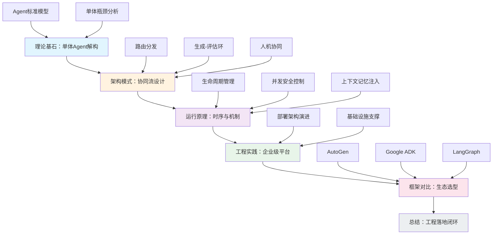

## 一、理论基石：从单体 Agent 到底层解构

要理解多智能体系统，必须先回答一个更基础的问题：单个Agent究竟是什么。很多人习惯把Agent等同于一条预设好的自动化流水线，或者一个被Prompt武装的大语言模型。这种理解在工作原理上是失真的，它忽略了Agent作为一个独立推理实体的完整结构。

### （一）重塑 Agent 的标准模型

Lilian Weng在她那篇广为人知的博文中提出了一个至今仍被广泛引用的Agent架构框架，它将Agent分解为四个核心组件：LLM、规划模块、记忆系统和工具调用能力。这个框架的洞察力在于，它没有把LLM当作Agent的全部，而是将它定位为推理中枢——一个负责任务分解、决策路由和语义理解的控制节点。LLM的作用不是执行，而是思考。真正的执行动作是由工具完成的，而如何安排这些动作的顺序和逻辑，则由规划模块负责。

下图展示了这个经典模型的四个组件及其交互关系：

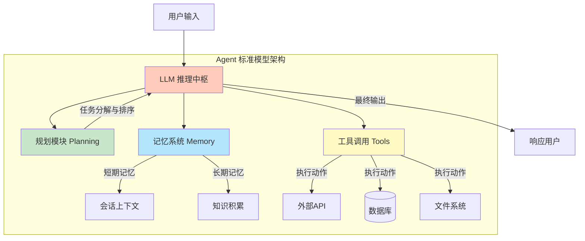

记忆系统在这个框架中承担的角色同样关键。它不只是简单地保存对话历史，而是需要区分短期记忆和长期记忆，前者用来维持当前会话的上下文连贯性，后者则承担跨会话的知识积累和用户画像构建。当一个Agent面对复杂任务时，它需要从记忆中提取相关的前置信息，结合当前的输入，生成下一步的行动计划。这个过程不是线性的，而是循环迭代的。Agent可能在执行到一半时发现新信息，需要回退到规划阶段重新调整策略，然后再继续执行。这种循环推理能力，是Agent区别于传统自动化脚本的本质特征。

工具调用层面同样值得深究。很多开发者在设计Agent时倾向于把尽可能多的工具接入进来，认为工具越多，Agent的能力就越强。但实际运行效果往往适得其反。当工具数量膨胀到一定程度，LLM在选择工具时会出现语义混淆，它将不得不在一堆功能相似但参数不同、名称相近但领域不同的工具之间做判断，而每次选择都伴随着出错的概率。

### （二）核心探讨：单体 Agent 的瓶颈与多智能体的破局

这里引出一个核心问题：为什么不能直接用一个大而全的单Agent解决所有事情？从表面上看，把所有Chain、所有Tool、所有Prompt规则一股脑塞进一个Agent里，似乎是最简单的方案，省去了拆分和协调的麻烦。但问题恰恰出在这个最简单方案的不可持续上。

下面的对比图清晰展示了单体架构与多智能体架构在复杂度管理上的根本区别：

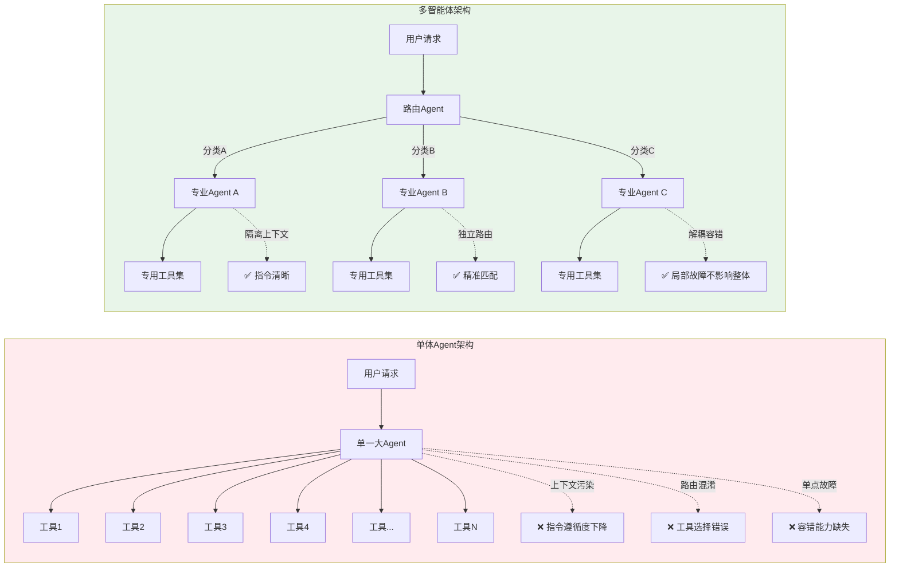

第一个瓶颈在于上下文污染。当单Agent需要处理的任务域过于宽泛时，Prompt会变得极其冗长。每条工具的描述、每种处理逻辑的规则说明、每个边界条件的限制约束，都需要被写进System Prompt或者注入到对话上下文中。这会导致两个后果。首先是Token消耗的急剧膨胀，直接影响推理成本和响应速度。更致命的是第二个后果：研究表明，当Prompt长度超过一定阈值之后，LLM对指令的遵循能力会出现断崖式下降。它会开始忽略中间的某些规则，或者把不同规则相互混淆，导致输出质量的不稳定。

第二个瓶颈是意图路由的准确性。在单体架构下，当一个用户请求进入系统，Agent需要自主判断这个请求应该触发哪条处理链路。如果工具数量少、任务域集中，这个判断相对来说还比较可靠。但当工具数量增加到几十甚至上百个时，LLM基于语义相似性进行路由匹配的准确率就会显著降低。一个请求可能匹配到多个功能相近但实际处理逻辑不同的工具，Agent必须在它们之间做出选择，而每一次错误的选择都会导致后续执行链路的整体偏离。

第三个瓶颈更加隐蔽，但却更加重要：容错能力的缺失。单Agent一旦在某个中间步骤出错，除非开发者预先编写了详尽的异常处理逻辑，否则错误会沿着执行链向后传播，最终导致整个任务的失败。在简单的Demo环境中，这种错误相对容易被捕获和修正。但在生产环境中，面对真实用户多样化的输入模式和复杂多变的边界条件，单体Agent的脆弱性会暴露得淋漓尽致。

多智能体架构的本质，就是通过对上述瓶颈进行结构化解耦来获得系统级的鲁棒性提升。当把系统拆分成多个独立的Agent，每个Agent只需要关注自己职责范围内的任务域时，单个Agent的Prompt长度得到了有效控制，模型对指令的遵循度得以保持在较高水平。同时，由于每个Agent的工具集被限定在特定领域内，路由匹配的准确率自然提升。更关键的是容错性：当一个Agent在执行中出错时，其他Agent可以继续运作，整个系统不会因为单点故障而完全瘫痪。

这种设计哲学背后遵循的是软件工程中关注点分离的原则，只是将它应用到了AI推理系统的架构设计中。每个Agent是一个独立的推理单元，拥有自己专属的工具集、记忆空间和Prompt配置，它们之间通过标准化的消息协议进行通信，而不是共享同一个混乱的全局状态空间。

## 二、架构模式：Multi-Agent 的经典协同流

拆分出多个Agent并不代表系统设计完成。真正决定系统效果的是这些Agent之间如何协同工作。不同的任务特性需要不同的协同模式，而每种模式都有自己适用和不适用的场景。这一节我们从广度扩展的角度，梳理三种最具代表性的协同架构。

三种协同模式的可视化对比：

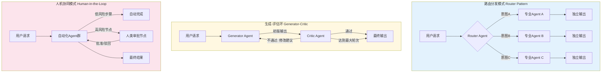

### （一）路由分发模式：精准的意图分类与专业处理

路由分发是Multi-Agent架构中最基础也最常用的模式。想象一个用户向系统提出一个涵盖多领域的问题：帮我分析一下最近一个季度的销售数据，同时检查一下我们的库存系统是否存在异常。如果用一个单Agent处理，它需要同时理解数据分析的维度和库存管理的业务逻辑，两者在Prompt中的规则描述可能会互相干扰，工具调用也可能出现冲突。

路由分发模式的处理方式是，系统首先部署一个专门的Router Agent。这个Agent的职责只有一个：对用户请求进行语义分类，判断它应该被路由到哪个或哪些专业Agent进行处理。Router不做具体的数据分析，也不懂库存管理的业务细节，它只需要在几个大类之间做出准确判断。这种职责的单一化使得它的Prompt可以保持精炼，路由决策的准确度也因此很高。

分类完成后，请求被下发给对应的专业Agent。数据分析Agent接到任务，调用自己专属的数据库查询工具和可视化工具，完成分析并返回结果。库存管理Agent同样在自己的领域内独立运作。两者不需要知道对方的存在，它们的Prompt、工具集、记忆空间完全隔离。最后，可能存在一个聚合层把两者的输出整合为统一回复，也可能直接分步返回给用户，这取决于具体产品形态。

这个模式的适用边界在哪里？它最适合请求类型明确可分、各处理链路之间几乎不存在强依赖关系的场景。但如果任务之间存在时序依赖或数据依赖，单纯的路由分发就不够用了。

### （二）生成-评估反馈环：对抗协作中的质量保障

Generator-Critic模式则服务于另一类任务：那些质量要求极高、单次生成难以保证满意结果的场景，比如代码生成、内容撰写、数据分析报告的自动化产出。在这个模式下，Generator负责产出初版内容，Critic负责对初版进行审查和评估，发现问题后反馈给Generator进行修改。整个过程形成一个循环，直到输出通过Critic的质检标准，或者达到了系统预设的最大迭代轮次。

这个模式的价值点在于，它将评审能力和生成能力剥离开来，分别部署在两个不同的Agent上。为什么不让同一个Agent既生成又评审？在实践中，LLM对自己的输出往往存在自我审查的盲区。让同一个模型检查自己刚刚生成的代码，它倾向于认为一切正常，因为生成过程中的思维惯性会延续到审查阶段。把审查职责交给另一个独立配置的Agent，可以用不同的Prompt来强化批判性思维，甚至在某些场景下使用不同的模型来进一步提升审查的客观性。

这套循环机制需要一个退出策略，否则可能陷入无限迭代。在实践中通常有两种退出条件。第一种是硬性的最大迭代次数限制，当循环轮次达到预设上限时强制终止，避免系统资源被无止境消耗。第二种是基于状态信号的动态退出，Critic在评估时不仅给出评审意见，还输出一个状态标记。如果该标记指示内容已经达标，循环提前终止——这需要Critic具备清晰的三元判断能力：接受、拒绝、需要修改。

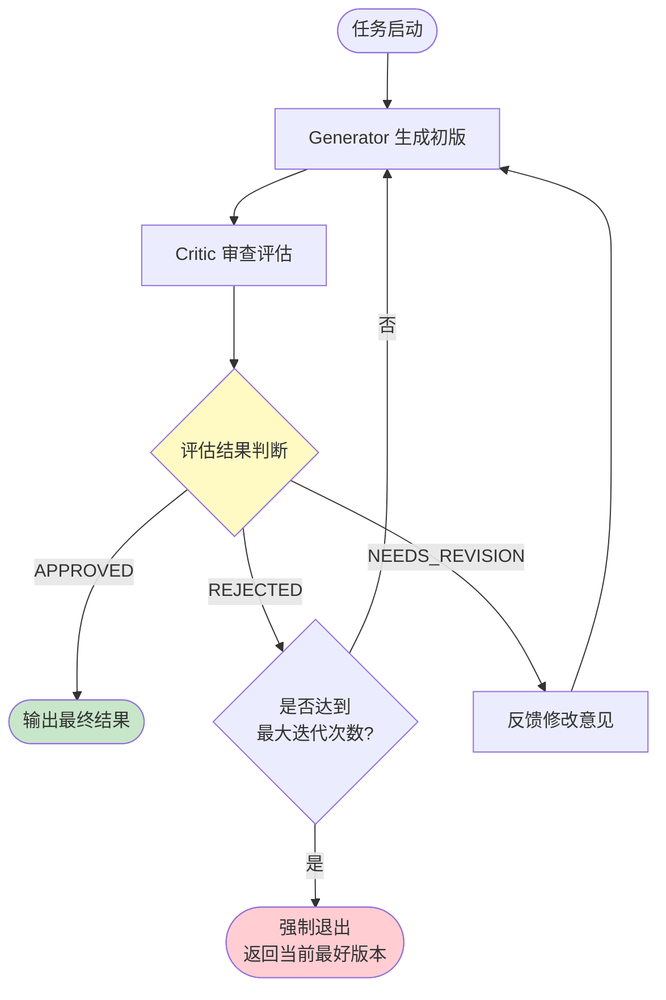

这个模式的局限性也需要被正视。首先是延迟问题，每增加一轮迭代，用户感知的响应时间就会线性增长。在实时交互场景下，多轮迭代可能严重影响体验。其次是Critic的评审质量本身也需要保障，如果Critic的标准过于宽松，循环退化为形式主义；如果过于严苛，Generator可能永远无法满足要求，最终触发最大轮次强行退出，输出结果反而可能是中间某个并不完美的版本。因此，在实际工程落地中，Critic的Prompt校准往往比Generator的构建耗费更多调试时间。

### （三）人机协同模式：安全引入人类判断的关键节点

不论自动化程度有多高，很多企业级场景天然要求人类的审批和干预能力。合同审查、财务审批、合规性判断这些领域，AI的推理结果只能作为建议，最终决定权必须保留在人类手中。Human-in-the-Loop模式解决的就是这个问题：在多Agent协作流程中，如何安全且优雅地引入人类干预节点，既不打断系统整体的自动化节奏，又能让人类在关键决策点上拥有控制权。

实现这个模式的工程挑战比表面看起来要大得多。首先是人机交互的异步性。Agent可能在一个任务执行到中间时触发了等待人类审批的状态，但这个人类可能不在线，可能在处理其他事务，可能几个小时甚至几天之后才会做出响应。系统必须能处理这种长时间等待，保持任务的上下文不丢失，在人类返回之后能够无缝恢复执行。这要求底层架构具备状态持久化和任务挂起-恢复机制，远比简单的同步流程复杂得多。

其次是审批节点的粒度设计。如果把审批做得太细，每一个小步骤都要人类介入，系统就退化成了带有AI辅助的传统人工流程，自动化能力大打折扣。如果做得太粗，只在一长串自动化执行完成之后给人类一个整体确认，人类实际上已经失去了有效审查的手段，因为信息量太大根本无法在短时间内消化。找到合适的粒度是产品设计层面的考验，通常需要根据业务风险等级进行动态调整——高风险的决策节点强制人类介入，低风险的执行节点则完全自动化。

## 三、运行原理：多智能体系统的内部时序与协同机制

协同模式定义了Agent之间宏观的互动关系，但是要让这些模式真正跑起来，还需要回答更深层的问题：Agent如何被创建和组装成团队？任务在执行过程中如何在不同Agent之间流转？当多个Agent并发运作时，如何保证数据一致性不被破坏？这一节我们下探到运行时层面。

### （一）团队生命周期：从配置到实例化的幕后过程

一个多Agent团队从被定义到真正开始执行任务，经历了一个被大多数开发者忽略的组建过程。这个过程从读取配置文件开始，配置中定义了哪些Agent参与本次任务，每个Agent的角色描述是什么，它拥有哪些工具权限，它与其他成员之间的通信关系如何。这些配置不是简单的参数列表，它们共同定义了团队成员之间的职能边界和信息流动方向。

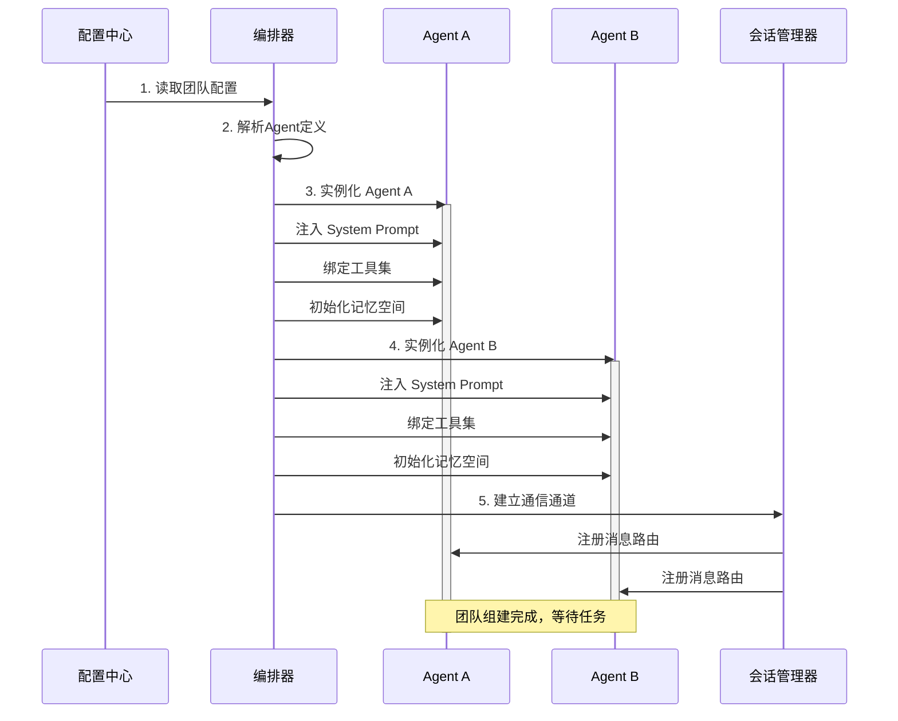

实例化阶段，系统根据配置为每个Agent分配独立的运行上下文。这个上下文中包含专门为该Agent定制的System Prompt、已加载的工具接口、初始化的记忆空间。在实例化完成之前，Agent之间互相不知道对方的存在，每个Agent看到的只是属于自己的那份配置。

组建团队的关键动作在于通信通道的建立。在多Agent架构中，通信机制通常分为两种模型。一种是中心化的广播-订阅模型，所有Agent的信息收发都经过一个中央枢纽，这个枢纽负责消息路由和格式转换。另一种是去中心化的点对点模型，Agent之间可以直接对话，每个Agent自己决定什么时候和谁通信。两种模型各有取舍：中心化模型便于监控和管理，但可能成为性能瓶颈；去中心化模型更加灵活，但系统整体的行为更难预测和调试。

### （二）执行时序与上下文交接

当任务正式启动，Agent之间的信息流动遵循一个精心设计的序列。执行过程不是所有Agent同时开工然后各自收尾，而是一个逐步展开的链条。负责接收用户请求的Agent首先被激活，它完成自己的处理环节之后，需要把执行结果以及当前积累的上下文信息一起传递给下一个Agent。

这个上下文交接的动作是整套架构中最容易被低估的复杂度来源。交接的不只是文本回复，还包括结构化的工作状态、已完成的子任务列表、尚未处理但需要在后续步骤中关注的遗留问题，以及当前对话会话的元数据。如果交接的信息过于精简，下游Agent缺少足够的背景来准确理解自己的任务全貌。如果交接的信息过于冗杂，就回到了单体架构的上下文污染问题上。

工程上的折中方案通常是在交接时对上下文做一次结构化压缩。上游Agent的输出经过一层格式化为标准化的交接对象，下游Agent接收到的不是原始对话历史，而是一个经过提炼和标注的结构化信息包。这个信息包中包含该Agent执行任务所必需的全部上下文，同时剔除了与它无关的历史细节。

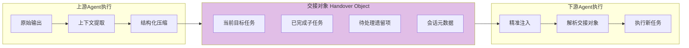

另一个关键问题是状态追踪。在多Agent协作中，任何一个Agent可能同时参与多个并行的任务会话，系统需要在任何时刻知道每个会话的执行进度、当前等待哪个Agent的响应、是否有异常需要干预。这就要求底层存在一个会话管理器，以会话为维度追踪整个团队的执行状态，而不是以Agent为维度进行管理。这个设计选择直接影响到系统在大规模部署时的可观测性。

### （三）并发安全与资源冲突

当系统从单个会话扩展到同时处理成百上千个会话的规模时，并发冲突问题浮出水面。多个Agent可能试图同时读写共享的资源：一个公共的知识库、一个数据缓存、一个文件存储位置。如果没有并发控制机制，一个Agent写入到一半的数据被另一个Agent读到，或者两个Agent同时对同一个文件进行写入操作，结果将不可预测。

在轻量级的实现中，文件锁是最常见的解决方案。当一个Agent需要写入共享资源时，它先申请该资源的一个独占锁，完成操作后释放锁，其他Agent在锁未释放时只能等待或选择其他资源。这个方案的实现成本低，适用于并发量不高的场景。

但在高并发环境下，文件锁的缺陷开始显现。锁的粒度通常不够精细，一个锁覆盖整个文件或者整个目录，导致大量Agent在等待一把锁的释放，整体吞吐量急剧下降。同时，如果持有锁的Agent因为异常退出没有释放锁，整个系统会陷入死锁状态。在分布式多节点部署的场景下，文件锁的跨节点有效性也成问题。

更健壮的架构会在文件锁之上引入分布式锁机制，利用分布式协调服务来实现更高级的加锁策略。粒度方面，可以通过将共享资源按逻辑分区、按哈希分片的方式来减少锁的竞争范围，让不同区间的并发操作可以互不干扰。但这一切的复杂度和运维成本都显著提升，这是技术负责人在做架构选型时需要清醒认知的成本。

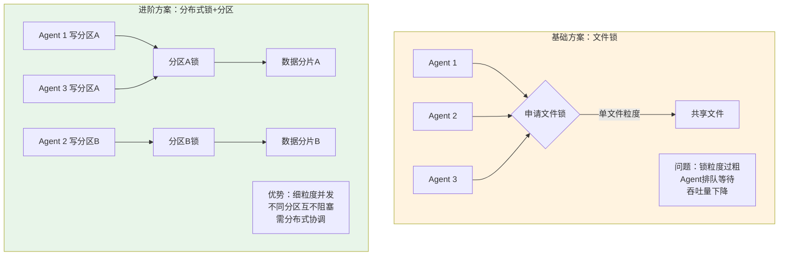

## 四、硬核工程实践：构建企业级托管智能体平台

前面讨论的协同模式和运行机制，大多建立在单机或者小规模部署的假设之上。但当组织想要真正把Multi-Agent系统落地为企业级平台——面向多个业务线、服务多个租户、承载生产流量——一系列全新的工程挑战就会出现。这一节的内容是区分Demo系统与企业级平台的真正分野所在。

### （一）从单机到云原生的部署架构演进

部署架构的演进通常沿着三个层级逐步推进，每一层级对应不同的业务规模和隔离需求。下面的演进路线图展示了从单体到多租户的完整升级路径：

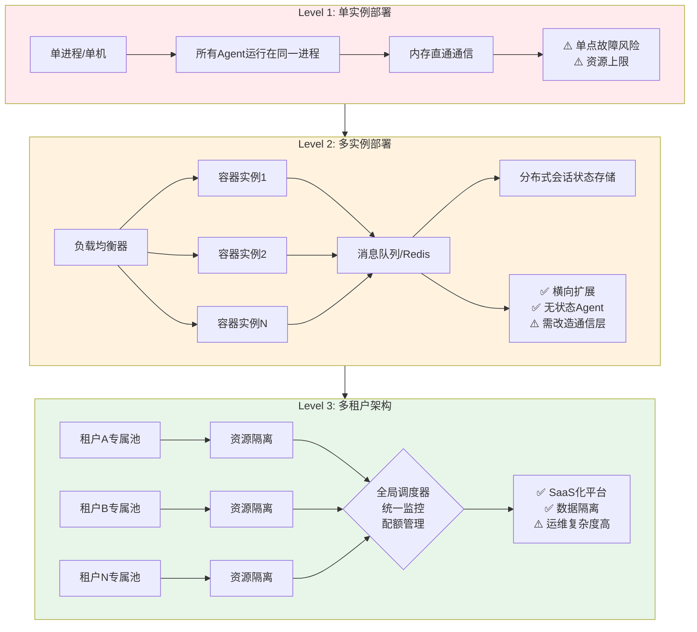

最基础的层级是单实例部署，也就是所有Agent运行在同一个进程或同一台机器上。这种模式下，Agent之间可以直接通过内存进行通信，延迟极低，开发调试也最方便。它的适用边界非常清晰：适用于开发阶段的快速验证，或者小流量的内部工具场景。一旦用户量上来，单实例的单点故障风险和资源瓶颈就成了不可忽视的问题。

接下来是多实例层级的部署。当系统需要处理更多并发请求时，单个进程的处理能力会达到上限。此时需要将Agent部署为多个容器实例，通过负载均衡分发请求。这种架构的复杂之处在于，原先单实例下直接基于内存的Agent间通信不再可行，必须转向基于消息队列或gRPC调用的跨实例通信机制。同时，会话状态也不再能保存在本地内存中，需要外挂到Redis之类的分布式缓存中，确保同一会话的不同请求即使被路由到不同实例上，也能读取到完整的历史上下文。

当平台进一步演进到服务多个租户时，多副本架构和多租户隔离就成了必需。此时不仅需要横向扩展，还需要在逻辑上对不同租户的Agent实例、数据存储、计算资源进行严格隔离。一个租户的Agent崩溃不能影响其他租户正在执行的任务；一个租户的高负载不能抢占其他租户的计算资源导致整体服务降级。这要求从网络层到存储层、从元数据管理到运行时调度，全部具备租户维度的隔离能力。

多租户架构是SaaS化Agent平台的唯一解，但它带来的额外开销也不容忽视。每个租户即使当前没有活跃请求，也需要保持一定的基础资源配置以支撑快速冷启动的响应需求。资源池的动态扩缩容策略需要同时考虑租户粒度和全局资源利用率之间的平衡。更麻烦的是Agent实例的隔离粒度问题：是一个租户独享一个Agent实例池，还是多个租户共享同一个池但通过逻辑隔离来分割？前者隔离性强但资源利用率低，后者资源利用率高但隔离性弱，需要工程师根据业务场景的风险偏好做出选择。

### （二）底层基础设施的工程支撑

企业级Multi-Agent平台不是一个简单的应用层项目，它需要一整套基础设施的支撑。这些基础设施往往比Agent本身的业务逻辑更加复杂，也是平台长期可维护性的关键保障。

资源隔离模型需要从多个维度进行设计。首先是计算资源的隔离，通常通过Kubernetes的Namespace和Resource Quota来实现，按租户级别设定CPU和内存的上限。其次是数据资源的隔离，每个租户的向量数据库、对话历史存储、用户配置文件，都必须存储在独立的逻辑空间内，避免任何形式的数据泄露风险。最容易被忽视的是模型调用配额的管理：当平台底层调用的是外部大模型API时，必须按租户设置API调用频率限制和Token消耗上限，防止某个租户无节制地消耗全局配额。

分布式链路追踪是多节点Agent相互调用场景下的必备能力。当一次用户请求触发了五个不同的Agent依次协作，如果在某个中间环节出现了延迟或者错误，运维人员需要能够精确地定位到是哪个Agent在哪个步骤出了问题。

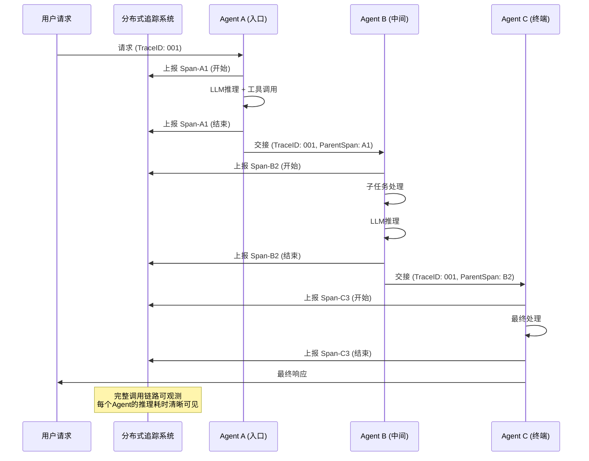

这意味着每个Agent在处理请求时需要生成和传递唯一的Trace ID，记录自己的处理开始时间和结束时间，并将这些跨度信息上报到统一的追踪系统。同时，由于Agent内部的推理链路可能包含多轮的LLM调用和工具调用，追踪的细粒度需要下探到推理步骤级别，而不仅仅是Agent到Agent的调用级别。

底层调度器则是大规模Agent集群的大脑。它需要维护每个Agent的运行状态，在接收到任务时根据Agent当前的负载、节点的可用资源、以及任务所属租户的优先级来进行调度决策。调度逻辑中还需要内嵌重试和降级策略：如果某个Agent处理失败，调度器要判断是立即重试、延迟重试还是切换到备用Agent链路上继续执行。这些调度策略不是静态配置的，而需要根据实时运行数据和历史表现进行动态调整，这对调度器的设计提出了相当高的要求。

## 五、行业主流框架的深度对比与选型逻辑

前面我们从原理层面拆解了Multi-Agent架构的各个层次，但在实际工程实践中，很少有人会从零开始实现所有这些基础设施。行业里已经出现了多个成熟的框架，它们在设计哲学、抽象层次和适用场景上存在显著差异。理解这些差异，远比知道每个框架支持哪些功能列表更重要。

三大主流框架的核心设计哲学对比：

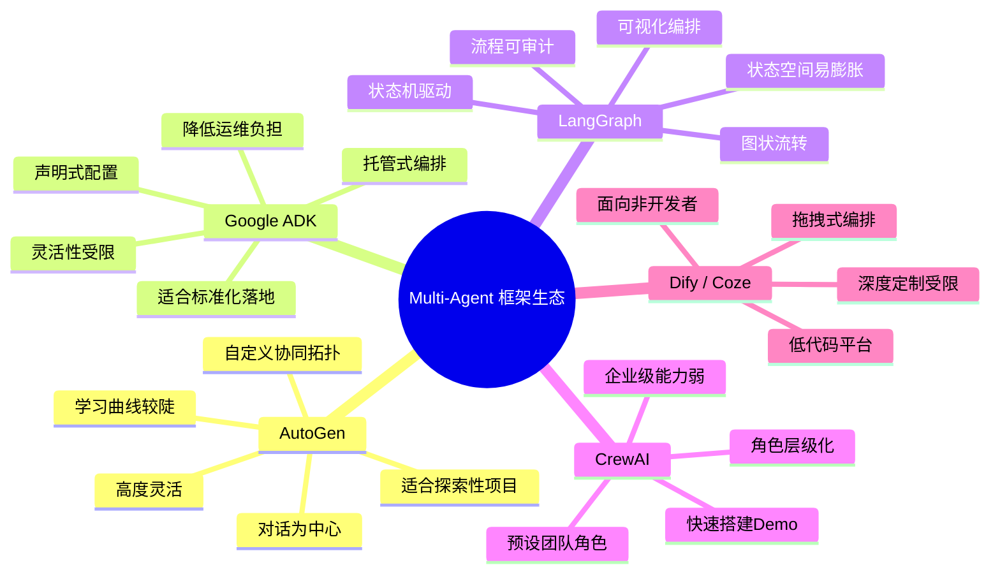

### （一）微软 AutoGen：对话模式的高度自定义化

AutoGen是微软推出的Multi-Agent框架，它的核心设计理念是将对话作为第一等公民。在AutoGen的视角下，Agent之间的每一次信息交换本质上都是一次对话回合，而Multi-Agent协作就是多轮对话的组合。这个设计理念的好处是表达能力足够强，你可以定义两个Agent之间如何开启对话、如何结束对话、对话中哪些信息会被传递、以及发生冲突时如何处理。

AutoGen支持将多个Agent组织成一个团队，团队成员可以有人类参与，也可以全部由AI担任。它没有强制预设的协同模式，开发者可以根据自己的需求自定义对话流转逻辑。这种灵活性使得AutoGen非常适合作为探索性项目和快速原型的开发框架——你可以自由组合出任何你想要的协作拓扑，而不受框架预设约束的限制。

但灵活性本身也有成本。由于框架没有内置固定的协同模板，开发者需要对协同模式有足够深刻的理解才能搭建出稳定可靠的系统。在缺乏约束的框架下写出低质量的Agent链，和在有约束的框架下写出高质量的Agent链，两者在代码工作量上差异很大，但最终系统的可靠性可能天差地别。所以AutoGen更适合有经验的开发者团队，或者对协同模式有明确设计思路的项目。

### （二）Google ADK 与结构化编排

Google推出Agent Development Kit和关联的编排框架时，选择的是一条不同的路径。它强调的是编排逻辑的可声明化和运行时的托管管理。与其让开发者在代码层面自由定义Agent之间怎么通信，ADK提供了一套较高抽象的编排原语，开发者声明Agent之间的关系、信息流方向和触发条件，框架负责底层的调度执行。

这种方式特别适合企业内部有较规范的业务流程、希望将Agent协作能力快速集成到现有系统中的场景。开发者不需要关心并发控制、状态管理和通信协议的细节，框架已经把这些复杂度封装在运行时引擎的内部。对于组织来说，这意味着更小的学习成本和更快的上线速度。

但托管化编排也意味着灵活性受到限制。如果业务场景需要一种框架没有预设的协同拓扑，开发者要么不得不通过复杂的Workaround来绕开框架的限制，要么就只能在框架之外另起炉灶。因此，ADK这类框架在标准化程度高、业务差异化较小的场景中表现优秀，而在需要高度定制化协同逻辑的场景下可能反成掣肘。

### （三）LangGraph：状态机驱动的Agent流转

LangGraph选择从图状状态机的视角来看待Multi-Agent协作。在它的世界里，每个Agent对应图中的一个或多个节点，Agent之间的执行流转对应图的有向边。整个任务的执行过程就是在这个图上的一次遍历：从起始节点出发，沿着边前进，每个节点执行自己的逻辑，然后决定下一步该走向哪个相邻节点。

状态机模型的优势在于它天然提供了可视化和可预测性。你在设计阶段就可以画出整个Agent流转的拓扑图，明确每个节点的功能、每条边上的条件判断、以及循环和回退的路径。这对于需要严格把控质量、需要清晰可审计的执行逻辑的场景来说，是非常重要的特性。

但同时，状态机模型的局限性也显而易见。如果任务路径非常复杂、包含大量动态分支和不确定性，那么状态空间会急剧膨胀，图的维护和调试会变得极为困难。当需要修改流程时，整个图都可能需要重构。LangGraph更适合于那些流程相对确定但步骤较多、需要精细控制每个环节执行条件的场景，而不太适合高度发散、自由对话式的任务。

把这三个框架放在一起对比，选择逻辑不在于哪个框架功能更强，而在于哪个框架的设计哲学更贴近你的实际场景。如果你的核心需求是灵活、不受约束的Agent间对话，AutoGen的对话中心模式最有吸引力。如果你的关注点在于快速标准化落地和降低运维复杂度，Google ADK的托管编排更合适。如果你的场景流程确定性较强、需要可视化编排和审计能力，LangGraph的状态机模型是自然的选择。

下表汇总了三个框架在不同维度上的侧重：

| 维度 | AutoGen | Google ADK | LangGraph |
|------|---------|------------|-----------|
| 核心抽象 | 对话回合 | 编排原语 | 有向状态图 |
| 灵活度 | 极高，支持自定义对话拓扑 | 中等，受托管编排限制 | 中等偏高，受图结构约束 |
| 学习曲线 | 较陡，需理解对话编程 | 较平缓，声明式配置 | 中等，需理解状态机 |
| 托管化程度 | 低，开发者控制运行时 | 高，框架封装调度细节 | 中等，框架管理图遍历 |
| 适用场景 | 探索性原型、高度定制流程 | 标准化企业集成 | 确定性多步流程、需审计 |
| 关键局限 | 缺少脚手架约束，易失控 | 灵活性不足，深度定制受阻 | 状态空间膨胀，图维护难 |

## 六、从理论框架到工程落地的完整闭环

技术博客写到这个位置，我们应当有能力把前面的所有讨论串成一个完整的故事。Multi-Agent架构不是凭空出现的学术概念，它是对单Agent系统在实践中遇到的结构性瓶颈所做出的工程回应。从最初的理论模型——LLM作为大脑、规划模块负责决策、记忆系统保存状态、工具层执行动作——到因为上下文污染和路由准确性问题而不得不在架构层面进行拆分解耦，整个演进过程遵循的是清晰的工程逻辑。

协同模式是为拆解后的多Agent设计高效协作机制的产物。路由分发聚焦于请求分类与专业化处理，生成-评估环聚焦于质量保障的循环优化，人机协同聚焦于关键风险节点的可控性。这些模式不是互相排斥的，在一个复杂的Multi-Agent系统中，可能同时组合了多种协同模式来覆盖不同的任务子域。

工程化落地是将理论能力转化为可规模化服务的关键一跳。从单实例到多实例，从多实例到多租户，每个层级的架构演进都伴随着通信机制、状态管理、资源隔离和可观测性的全面重构。基础设施层的投入——分布式追踪、调度系统、熔断降级——往往是决定平台能否承载生产流量的决定性因素。

下面的完整闭环图总结了从理论到工程的全链路：

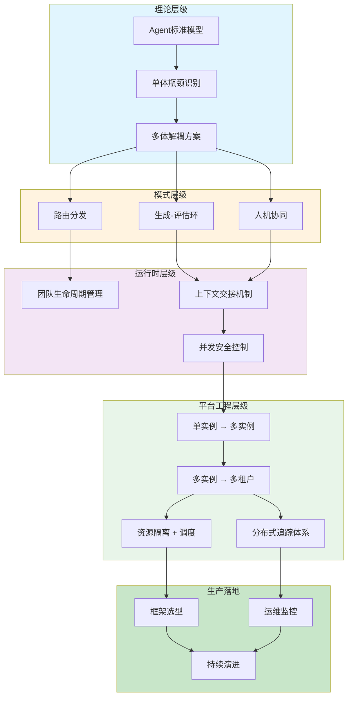

未来展望，Agent技术正在深刻改变软件工程本身的形态。过去我们认为软件是由代码、配置文件、部署脚本组成的人造产物。现在，Agent系统引入了一种新的范式：软件的某些逻辑不再由开发者显式编写，而是由Agent在运行时根据推理能力动态生成。这对开发者的角色定位、测试方法、运维策略都提出了全新的挑战。测试不再只是验证代码的输入输出，还需要评估Agent推理路径的合理性和安全性。运维不再只是关注CPU和内存指标，还需要监控Agent的对话质量、工具调用成功率、推理循环耗时等全新维度的数据。

在这个转变中，架构师的系统思维比以往任何时候都更加重要。理解单体与多体之间的权衡边界，理解每种协同模式的适用条件与失效场景，理解从单机Demo到多租户平台之间每一层架构升级的必然性与代价——这些不是可以跳过的基础知识，而是决定一个AI系统能否真正走向生产环境的核心竞争力。Agent技术本身还在快速演进，但这些架构层面的基本原则，大概率会比任何具体框架活得都更长久。

**全文核心架构决策路径回顾：**

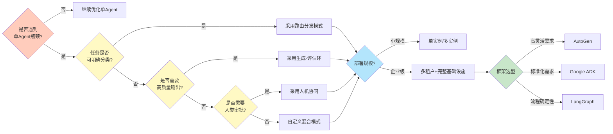

这篇文章试图呈现的不仅是技术方案的罗列，而是一条从问题识别到方案设计、从原型验证到规模化落地的完整工程链路。架构没有银弹，Multi-Agent也不是万能解药。但当你面对单Agent系统在复杂场景下日渐失控的表现时，希望这篇文章能为你提供一套清晰的分析框架：问题出在哪里，有哪些方案可选，每种方案的成本和收益是什么，以及如何一步步将其落地为可运行、可扩展、可维护的生产系统。这，就是工程的意义所在。
